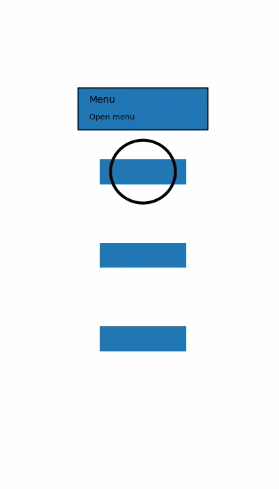

## AppTour — Android Walkthrough / App Tour
[](https://kotlinlang.org/)
[](LICENSE)
[](#)

A lightweight and customizable App Tour / Walkthrough Overlay library for Android.
Guide users through your app features with spotlight highlights, tooltips, and step-by-step instructions.

---

### Features

- Spotlight highlight on any View

- Multiple step walkthrough

- Tooltip with title and description

- Next and Skip buttons

- Smart tooltip positioning

- Highlight shapes

    - Circle

    - Rectangle

    - Rounded Rectangle

- Customizable overlay color

- Custom tooltip background

- Custom text colors

- Highlight padding control

---

### Preview



---

## Installation

### Step 1: Add JitPack

```gradle
dependencyResolutionManagement {
    repositories {
        google()
        mavenCentral()
        maven { url 'https://jitpack.io' }
    }
}
```

### Step 2: Add Dependency

```gradle
dependencies {
	        implementation 'com.github.Excelsior-Technologies-Community:Android_GlobalLoaderOverlay:Tag'
	}
```

---

### Basic Usage

Create a simple walkthrough like this:

```kotlin
AppTour.with(this)
    .addStep(
        TourStep(
            view = findViewById(R.id.menuButton),
            title = "Menu",
            description = "Open navigation menu"
        )
    )
    .addStep(
        TourStep(
            view = findViewById(R.id.profileButton),
            title = "Profile",
            description = "View your profile here"
        )
    )
    .start()
```

Multi Step Walkthrough

```kotlin
AppTour.with(this)
    .addStep(TourStep(menuButton,"Menu","Open menu"))
    .addStep(TourStep(profileButton,"Profile","View profile"))
    .addStep(TourStep(settingsButton,"Settings","Change preferences"))
    .start()
```

Highlight Shapes

```kotlin
AppTour.with(this)
    .setHighlightShape(HighlightShape.CIRCLE)
```

Available options:
```kotlin
HighlightShape.CIRCLE
HighlightShape.RECTANGLE
HighlightShape.ROUNDED_RECTANGLE
```

Example

```kotlin
AppTour.with(this)
    .setHighlightShape(HighlightShape.ROUNDED_RECTANGLE)
    .setHighlightPadding(12)
    .addStep(
        TourStep(
            findViewById(R.id.button),
            "Test Button",
            "Click this button to continue"
        )
    )
    .start()
```

---

### Customization

```kotlin
AppTour.with(this)
    .setOverlayColor(Color.parseColor("#99000000"))
    .setTooltipBackground(Color.WHITE)
    .setTitleTextColor(Color.BLACK)
    .setDescriptionTextColor(Color.GRAY)
    .setHighlightPadding(16)
    .addStep(TourStep(button,"Button","Click this button"))
    .start()
```

---

### License

```
MIT License

Copyright (c) 2025 Excelsior Technologies 

Permission is hereby granted, free of charge, to any person obtaining a copy
of this software and associated documentation files (the "Software"), to deal
in the Software without restriction, including without limitation the rights
to use, copy, modify, merge, publish, distribute, sublicense, and/or sell
copies of the Software, and to permit persons to whom the Software is
furnished to do so, subject to the following conditions:

The above copyright notice and this permission notice shall be included in all
copies or substantial portions of the Software.

THE SOFTWARE IS PROVIDED "AS IS", WITHOUT WARRANTY OF ANY KIND, EXPRESS OR
IMPLIED, INCLUDING BUT NOT LIMITED TO THE WARRANTIES OF MERCHANTABILITY,
FITNESS FOR A PARTICULAR PURPOSE AND NONINFRINGEMENT. IN NO EVENT SHALL THE
AUTHORS OR COPYRIGHT HOLDERS BE LIABLE FOR ANY CLAIM, DAMAGES OR OTHER
LIABILITY, WHETHER IN AN ACTION OF CONTRACT, TORT OR OTHERWISE, ARISING FROM,
OUT OF OR IN CONNECTION WITH THE SOFTWARE OR THE USE OR OTHER DEALINGS IN THE
SOFTWARE.
```
